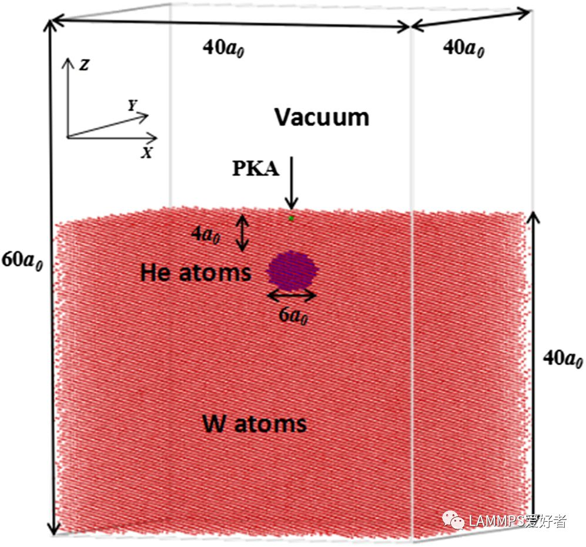
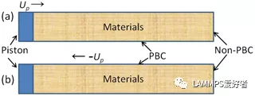
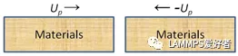

### Computational Materials Science, 148 (2018) 242-248.

* 主要研究了在辐照与无辐照条件下，钨表面下氦泡的释放情况。

* 定义相关变量：

  ```lammps
  variable      iseed index 238 476 714 952 1190 1428 1666
  variable      ipoint loop 7
  variable      T equal 300
  ```

* 模型：

  

* 构建模型：

  ```lammps
  lattice       bcc 3.1652 orient x 0 1 0 orient y 0 0 1 orient z 1 0 0
  region        box block 0 40 0 40 0 60 units lattice
  region        w block 0 40 0 40 0 40 units lattice
  create_box    2 box
  create_atoms  1 region w
  region        inner sphere 20 20 33 3 units lattice
  group         inner region inner
  delete_atoms  group inner
  create_atoms  2 random ${iseed} 12345 inner
  ```

* 无辐照条件下的氦泡演化的过程：

  ```lammps
  units         metal
  atom_style    atomic
  boundary      p p f
  ```

* 选中表面中心PKA原子：

  ```lammps
  region        rpka sphere 20 20 40 0.1
  group         pka region rpka
  ```

* 定义原子间相互作用势

  ```lammps
  pair_style       eam/alloy
  pair_coeff       * * W_He.eam.alloy W He
  ```

* 优化：

  ```lammps
  min_style      sd
  minimize       1.0e-12 1.0e-12 10000 100000
  ```

* 计算原子势能：

  ```lammps
  compute      1 all pe/atom
  ```

* 定义输出：

  ```lammps
  thermo         1000
  thermo_style   custom step temp pe etotal dt time
  thermo_modify  lost ignore  # 边界条件设置了f，允许系统丢失原子
  dump           1 all custom 20000 whe.${iseed}.${T}.xyz id type x y z c_1
  ```

* 模型环境设置：

  * nvt弛豫

  ```lammps
  velocity      all create ${T} ${iseed} rot yes dist gaussian
  fix           1 all nvt temp ${T} ${T} 0.05
  timestep      0.0001
  run           200000
  ```

  * nve级联碰撞

    ```lammps
    unfix        1
    fix          1 all nve
    velocity     pka set 0 0 -1000 units box
    fix          2 all dt/reset 1 0.000000001 0.0005 0.005 units lattice
    run          800000
    ```

* 进入下一次循环：

  ```lammps
  unfix       1
  unfix       2
  clear
  next        iseed
  next        ipoint
  jump        in.hebubbleW
  ```

* 循环结束退出：

  ```lammps
  quit
  ```

### Shockwave generates <100> dislocation loops in bcc iron

* 金属材料中常见的辐照损伤模拟

* 初始模拟设置：

  ```lammps
  units         metal
  atom_style    atomic
  boundary      p p p
  ```

* 模型构建

  ```lammps
  lattice        bcc 2.8552
  region         box block 0 30 0 30 0 30 units lattice
  create_box     1 box
  create_atoms   1 box
  ```

* 选取中心原子为PKA（初始碰撞原子，由这个原子引发级联碰撞）：

  ```lammps
  region     rpka sphere 15 15 15 0.2 units lattice
  group      pka region rpka
  ```

* 定义原子间相互作用势：

  ```lammps
  pair_style         eam/fs
  pair_coeff         * * Fe_mm.eam.fs Fe
  ```

* 定义输出：

  ```lammps
  thermo           2000
  thermo_style     custom step temp etotal time
  dump             1 all custom 500 Fe.xyz id type x y z
  ```

* NVT弛豫：

  ```lammps
  velocity         all create 1000 666 rot yes dist gaussian
  fix              1 all nvt temp 300 300 0.05
  timestep         0.001
  run              15000
  ```

* NVE级联碰撞：

  ```lammps
  unfix          1
  velocity       pka set 300 500 600 units box
  fix            1 all nve
  fix            2 all dt/reset 1 0.00000001 0.0005 0.0005 units lattice
  run            75000
  ```

### 组合势（Radiation damage resistance and interface stability of copper-graphene nanolayered composite）

* 研究了Cu-Gr（石墨烯）界面的稳定性以及抗辐照性能

* Cu-Cu相互作用（EAM势函数），C-C相互作用（AIREBO势函数）以及Cu-C相互作用（LJ势函数$E=4\varepsilon [(\frac {\sigma} {\bar r})^{12} - (\frac {\sigma} {\bar r})^6],(\bar r<r_c)$，其中$\varepsilon_{(Cu-C)}=0.0117eV,\sigma_{(Cu-C)}=3.0023\AA,r_c=2.5\sigma_{(Cu-C)}$）。

* 定义原子间相互作用势：

  ```lammps
  pair_style        hybrid eam lj/cut 7.5 airebo 2.0
  pair_coeff        * * eam Cu_u3.eam
  pair_coeff        1 2 lj/cut 0.0117 3.0023
  pair_coeff        * * airebo CH.airebo NULL C
  ```

### 常见系综介绍

* **NVT（正则系综）**：常用于体系平衡弛豫

  ```lammps
  fix    1 all nvt temp T_beg(起始温度) T_end(终止温度) T_damp drag num(阻尼系数，一般不建议设置，设置后不再是真正意义上的NVT系综)
  ```

* **NPT（等温等压）**：

  * 控制x,y,z三个方向的压强，常用于计算晶格常数

    ```lammps
    fix   1 all temp T_beg T_end Tdamp iso P_beg P_end P_damp drag num
    ```

  * 只控制x,y两个方向的压强，或只控制一个方向，常用于压缩、拉伸模拟

    ```lammps
    fix    1 all temp T_beg T_end T_damp iso x P_beg P_end Pdamp y P_beg P_end Pdamp drag num
    ```

* **NVE（微正则系综）**：常用于冲击、辐射等模拟

  ```lammps
  fix    1 all nve
  ```

* **NPH（等压等焓）**

### LAMMPS模拟冲击压缩

* 冲击波通常是由爆炸或宏观物体的高速碰撞产生的，如炸药爆炸，高速弹丸穿甲，陨石撞击等。冲击波作用下材料在极短时间内发生塑性形变、熔化或化学反应等本质上不可逆的变化。冲击载荷相关的空间尺度（如晶格层次形变）和时间分辨率（皮秒至飞秒量级）都非常适合于通过MD模拟进行研究。

* 使用LAMMPS进行非平衡分子动力学模拟时产生冲击波主要有以下三种方式：

  * 活塞（piston）冲击法或“动量镜”（momentum mirror）法：在非平衡分子动力学模拟中应用比较多。

    图（a）中无限大质量的活塞以速度$+U_p$移动，推动相对静止的材料并在其中产生冲击波；或者等效地如图（b），活塞处于静止状态而材料整体以速度$-U_p$向活塞面移动，所有与活塞面接触的粒子都被反射或速度反向，即活塞面相当于“动量镜”。这种方法在侧向上使用周期性边界条件，而在冲击方向使用非周期性边界条件。

    ```lammps
    region piston block INF INF INF INF INF 5
    region bulk block INF INF INF INF 5 INF
    group piston region piston
    group bulk region bulk
    
    velocity piston set 0 0 v_Up sum no units box  # 设定piston的速度为v_Up，沿z轴冲击
    fix 2 piston setforce 0.0 0.0 0.0  # 设定piston内原子受力为0
    ```

    

  * 对称冲击法（symmetric impact）:两等质量的材料分别以$+U_p$和$-U_p$的速度相向运动，在中间处发生碰撞并在中心处产生$-U_s$和$+U_s$的冲击波向外边界传播。这种方法和实验中飞片（flyer）撞击靶板材料而产生平面冲击波的情况类似。冲击方向为非周期性边界，其余两侧为周期性边界。

    ```lammps
    velocity  left set NULL NULL v_Up sum yes units box
    velocity  right set NULL NULL -v_Up sum yes units box
    ```

    

  * 收缩周期性边界条件（shrinking periodic boundary conditions）方法：收缩周期性边界条件方法，这里使用三维周期性边界条件。两等质量的材料也分别以$+U_p$和$-U_p$的速度相向运动，而冲击压缩时边界也以恒定的速度Up跟随收缩。

    ```lammps
    velocity  left set NULL NULL v_Up sum yes units box
    velocity  right set NULL NULL -v_Up sum yes units box
    fix       2 all deform 1 z erate -v_rate units box
    # fix deform使边界收缩，v_rate为工程应变率，收缩为负号，其值与冲击时间与最终收缩量相关。边界收缩时为保持周期性，两侧边界（Lz1和Lz2, 并假设冲击方向为z）都要做出相应的收缩调整Lz1(t)= Upt; Lz2(t)= Lz0 - Upt。Lz0为边界初始值。这种方法可在冲击波刚好到达两端边界时终止冲击并停止收缩边界。停止收缩边界的时刻可用两块材料的动能差最小或者质心速度差值最小作为判据。理论上此时体系质心速度近似为0，因而可以研究非平衡加载之后体系后续较长时间的演化过程，如化学反应和扩散混合等。单纯收缩边界情况下冲击波也可以从两侧边界产生并向中间传播，可达到同样的效果。对称冲击方法能有效消除流体自由表面的影响，特别适用于流体中冲击波的模拟。
    ```

### 铜和铝的熔化

* 建立$8\times 8 \times 5$的FCC晶格，弛豫后利用Nose-Hover方法，保持压强为0，使体系从T=2.5K开始加热，直至发生熔化转变：

  ```lammps
  units           metal
  boundary        p p p
  atom_style      atomic
  
  variable        x equal 2.5
  
  lattice         fcc 3.61
  
  region          box block 0 8 0 8 0 5
  
  create_box      1 box
  create_atoms    1 box
  
  timestep        0.01
  
  thermo          1000
  
  pair_style      eam/alloy
  pair_coeff      * * jin_copper_lammps.setl Cu
  
  neighbor        0.5 bin
  neigh_modify    every 5 delay 0 check yes
  
  fix             1 all nvt $x $x 1.0 drag 0.2
  
  run             10000
  
  unfix           1
  fix             1 all npt $x 2000 4.00 xyz 0.0 0.0 6.0 drag 0.2
  run             1200000
  ```

### 两种结构优化方式

* **只调整体系中原子的坐标而不改变整个盒子形状**

* **优化时不仅调整原子坐标而且允许盒子形状发生变化**：多出命令

  ```lammps
  fix     1 all box/relax iso 0.0 vmax 0.01
  ```

### 金刚石冲击石墨烯

```lammps
# 将默认的输出的log.Lammps命名为log.Graphene_impact
log log.Graphene_impact

# 计算过程输出到屏幕
echo screen

dimension       3
units           metal
atom_style      atomic
boundary        p p p

region          box block -210 210 -240 240 -5 200 units lattice
create_box      1 box

lattice         custom 2.4595 a1 1 0 0 a2 0 1.73203 0 &
 basis 0 0 0 &
 basis 0.5 0.1666666 0 &
 basis 0.5 0.5 0 &
 basis 0 0.66666666 0
 
region          graphene block -210 210 -240 240 0 0.1 units lattice
create_atoms    1 region graphene

mass            * 12.011

pair_style      airebo/morse 3.0
pair_coeff      * * CH.airebo-m C

compute         3 all pe/atom
compute         4 all stress/atom NULL virial

velocity        all create 300.0 12345 dist gaussian
fix             1 all npt temp 298 298 .5 x 0.0 0.0 .5 y 0.0 0.0 .5

thermo          10
thermo_style    custom step pe ke etotal temp lx ly lz press atoms
dump            eve all custom 25 dump.graphene_impact.* id type x y z vx vy vz c_3 c_4[1] c_4[2] c_4[3]
timestep        0.001

fix             bp all balance 250 1 shift z 10 1
thermo_style    custom step temp ke pe press vol
run             50

group           graphene region graphene

variable        ymn equal ylo+4
variable        ymx equal yhi-4
variable        xmn equal xlo+4
variable        xmx equal xhi-4

region          middle block ${xmn} ${xmx} ${ymn} ${ymx} -5 5 units box
group           middle region middle
group           edge subtract graphene middle

unfix           npt

lattice         diamond 3.567
region          mobile sphere 0 0 150 30 units box
create_atoms    1 region mobile
group           impactor region mobile

change_box      all boundary p p s

reset_timestep  0
velocity        edge set NULL NULL 0 sum no units box
fix             sheet edge setforce NULL NULL 0.0
velocity        impactor set 0.0 0.0 -20.0 sum yes units box

fix              nve all nve
timestep         0.002
run              20000

print            "Job's done"
```

### Cu吸附原子在Cu表面的扩散

```lammps
units            metal
dimension        3
boundary         p p s
atom_style       atomic

lattice          fcc 3.614
variable         cubel equal 4
variable         fixer1 equal "v_cubel+2"
variable         fixer2 equal "v_cubel+1.49"

region           box block -${cubel} ${cubel} -${cubel} ${cubel} -${fixer1} 1 units lattice
region           cbox block -${cubel} ${cubel} -${cubel} ${cubel} -${fixer2} 0 units lattice

create_box       1 box
create_atoms     1 region cbox
create_atoms     1 single -0.5 0.5 units lattice

region           hold block INF INF INF INF -${fixer1} -${fixer2} units lattice
region           temp block INF INF INF INF -${fixer2} -${cubel} units lattice
group            hold region hold
group            temp region temp

pair_style       eam/alloy
pair_coeff       * * Cu01.eam.alloy Cu

compute          pe all pe/atom

timestep         0.005
compute          new all temp
velocity         temp create 600 12345
fix              heater temp temp/rescale 1 850 850 5 1
fix              nve all nve
fix              freeze hold setforce 0 0 0

dump             eve all custom 5 dump.adatom.* id type xu yu zu vx vy vz c_pe
thermo           50
run              100000

print            "Job's done"
```

